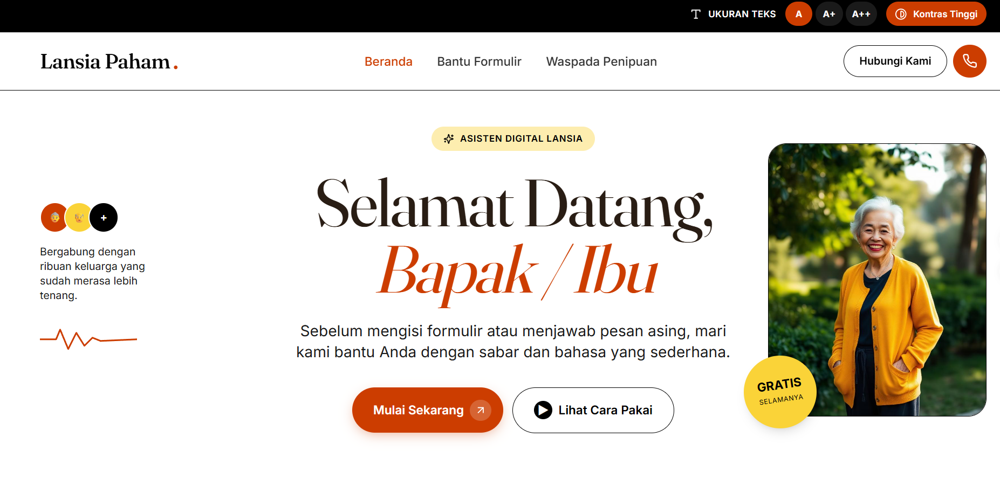

# 🧓 Lansia Paham

> Asisten digital yang sabar dan ramah, dibuat khusus untuk membantu lansia Indonesia memahami dunia digital dengan tenang.

<p align="center">
  
</p>

---

## 📋 Daftar Isi

- [Tentang Project](#tentang-project)
- [Fitur Utama](#fitur-utama)
- [Screenshots](#screenshots)
- [Tech Stack](#tech-stack)
- [Cara Menjalankan](#cara-menjalankan)
- [Struktur Project](#struktur-project)
- [Rencana Pengembangan](#rencana-pengembangan)
- [Kontribusi](#kontribusi)

---

## 🎯 Tentang Project

**Lansia Paham** adalah aplikasi web yang dirancang khusus untuk membantu lansia Indonesia dalam dua hal utama:

1. **Mengisi formulir** — KTP, BPJS, formulir bank, dan dokumen lainnya dijelaskan langkah demi langkah dengan bahasa yang sederhana
2. **Mendeteksi penipuan** — pesan WhatsApp, telepon mencurigakan, atau modus penipuan online dianalisis dan diberi penilaian risiko

Aplikasi ini dibangun dengan mempertimbangkan kemudahan penggunaan untuk lansia: huruf besar, bahasa sederhana, tombol yang jelas, dan dukungan foto/gambar.

---

## ✨ Fitur Utama

- 💬 **Chat AI** — tanya jawab interaktif dengan AI menggunakan bahasa Indonesia sederhana
- 📷 **Kirim Foto** — upload foto formulir atau screenshot pesan untuk dianalisis
- 🛡️ **Risk Meter** — indikator visual persentase risiko penipuan (Aman / Mencurigakan / Penipuan)
- ♿ **Accessibility Bar** — pengaturan ukuran teks dan kontras tinggi untuk lansia
- 📱 **Responsive** — bisa diakses dari HP maupun komputer
- 🌙 **Contoh Pertanyaan** — starter questions agar lansia tidak bingung memulai

---

## 📸 Screenshots

> **Catatan:** Tambahkan screenshot ke folder `docs/screenshots/` dengan nama file berikut:

| Nama File | Halaman yang Di-screenshot |
|---|---|
| `banner.png` | Hero section halaman utama (full width) |
| `home.png` | Halaman beranda lengkap |
| `asisten.png` | Halaman Bantu Formulir dengan contoh percakapan |
| `waspada.png` | Halaman Waspada Penipuan dengan risk meter muncul |
| `risk-meter.png` | Close-up risk meter saat mendeteksi penipuan |
| `mobile.png` | Tampilan mobile (gunakan DevTools → Toggle Device) |
| `accessibility.png` | Accessibility bar aktif dengan teks diperbesar |

### Cara Ambil Screenshot yang Baik untuk README:
1. Buka app di browser (`npm run dev`)
2. Gunakan **Chrome DevTools** → `Ctrl+Shift+I` → klik ikon HP untuk mobile view
3. Untuk full page screenshot: `Ctrl+Shift+P` → ketik `screenshot` → pilih **"Capture full size screenshot"**
4. Simpan di folder `docs/screenshots/`

---

## 🛠️ Tech Stack

### Frontend
| Technology | Kegunaan |
|---|---|
| React 18 + TypeScript | Framework utama |
| Vite | Build tool & dev server |
| Tailwind CSS | Styling |
| React Router v6 | Routing |
| Lucide React | Icons |
| React Markdown | Render markdown dari AI |

### Backend
| Technology | Kegunaan |
|---|---|
| Express.js | API server |
| SumoPod API | AI provider (OpenAI-compatible) |
| OpenAI SDK | Client library untuk API calls |
| dotenv | Manajemen environment variables |

---

## 🚀 Cara Menjalankan

### Prerequisites
- Node.js v18+
- npm atau yarn
- API Key dari [SumoPod](https://sumopod.com)

### 1. Clone repository
```bash
git clone https://github.com/TioSatrio100/Lansia-Paham-v2.git
cd Lansia-Paham-v2
```

### 2. Install dependencies
```bash
npm install
```

### 3. Setup environment variables
Buat file `.env` di root project:
```env
SUMOPOD_API_KEY=sk-xxxxxxxxxxxxxxxx
```

### 4. Jalankan aplikasi

Buka **dua terminal** secara bersamaan:

```bash
# Terminal 1 — Frontend (Vite)
npm run dev

# Terminal 2 — Backend (Express)
npm run server
```

Buka browser di `http://localhost:8080`

---

## 📁 Struktur Project

```
Lansia-Paham-v2/
├── src/
│   ├── assets/                  # Gambar statis
│   ├── components/
│   │   ├── ui/                  # Komponen shadcn/ui
│   │   ├── AccessibilityBar.tsx # Bar pengaturan aksesibilitas
│   │   ├── ChatBox.tsx          # Komponen chat utama
│   │   ├── FormattedMessage.tsx # Render pesan AI dengan markdown
│   │   ├── Layout.tsx           # Layout wrapper (navbar + footer)
│   │   ├── Navbar.tsx           # Navigasi utama
│   │   └── RiskMeter.tsx        # Indikator risiko penipuan
│   ├── contexts/
│   │   └── AccessibilityContext.tsx
│   ├── pages/
│   │   ├── Index.tsx            # Halaman beranda
│   │   ├── Asisten.tsx          # Halaman bantu formulir
│   │   ├── Waspada.tsx          # Halaman deteksi penipuan
│   │   └── NotFound.tsx
│   └── index.css                # Design system & CSS variables
├── server.ts                    # Express API server
├── vite.config.ts
├── tailwind.config.ts
└── .env                         # API keys (tidak di-commit)
```

---

## 🗺️ Rencana Pengembangan

### v2.1 — Voice Input 🎤
- [ ] Tambah tombol mikrofon di ChatBox
- [ ] Integrasi Web Speech API (Speech Recognition)
- [ ] User bisa bicara langsung tanpa mengetik
- [ ] Sangat membantu lansia yang kesulitan mengetik

### v2.2 — History Chat + Database 🗃️
- [ ] Integrasi PostgreSQL / MongoDB
- [ ] Simpan riwayat percakapan per sesi
- [ ] User bisa lihat kembali percakapan sebelumnya
- [ ] Sistem autentikasi sederhana (login dengan nomor HP)

### v2.3 — Chrome Extension 🧩
- [ ] Extension screenshot formulir online otomatis
- [ ] AI analisis field formulir langsung di browser
- [ ] Highlight kolom yang perlu diisi
- [ ] Auto-fill kolom berdasarkan data yang disimpan user

### v2.4 — Auto-fill Formulir 📝
- [ ] User simpan data pribadi (nama, NIK, tanggal lahir) secara lokal
- [ ] Deteksi field formulir otomatis
- [ ] Isi formulir online dengan satu klik
- [ ] Enkripsi data lokal untuk keamanan

### v2.5 — Offline Mode (PWA) 📲
- [ ] Install app ke homescreen HP
- [ ] Cache halaman utama untuk akses offline
- [ ] Push notification untuk pengingat
- [ ] Ukuran ringan, cocok untuk HP lansia

---

## 🤝 Kontribusi

Pull request sangat disambut! Untuk perubahan besar, buka issue terlebih dahulu untuk mendiskusikan apa yang ingin diubah.

---

## 📄 Lisensi

MIT License — bebas digunakan dan dimodifikasi.

---

<div align="center">
  Dibuat dengan ❤️ untuk komunitas lansia Indonesia 🇮🇩
</div>
